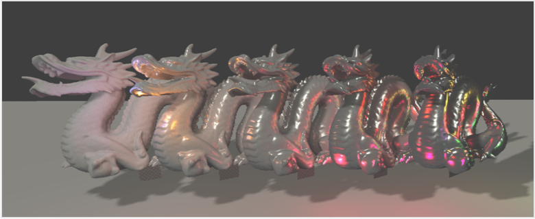
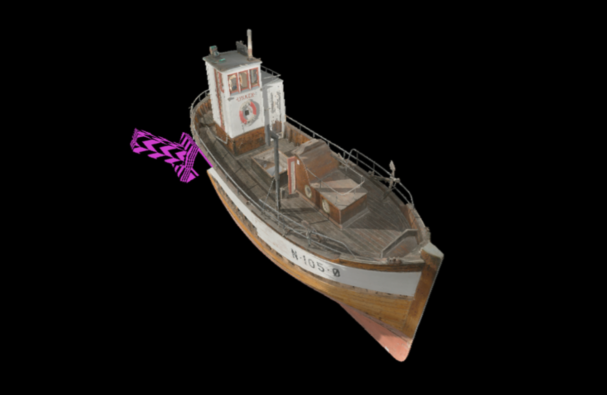
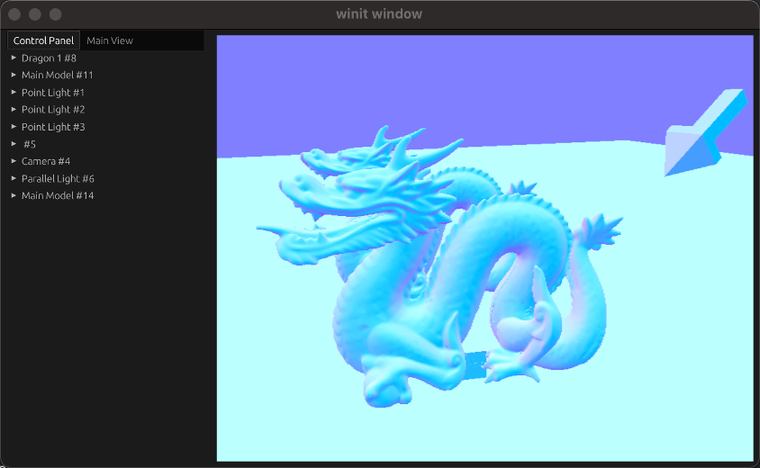

# Wgpu PBR
A realtime PBR renderer project for personal learning. Now it's in progress.

Powered by

- [wgpu](https://wgpu.rs/): A cross-platform, safe, pure-rust graphics API.
- [winit](https://github.com/rust-windowing/winit): Cross-platform window creation and management in Rust.
- [cgmath](https://github.com/rustgd/cgmath): Mathmatic library.
- [bevy_ecs](https://docs.rs/bevy_ecs/latest/bevy_ecs/): Entity Component System architecture in Rust by bevy engine.

