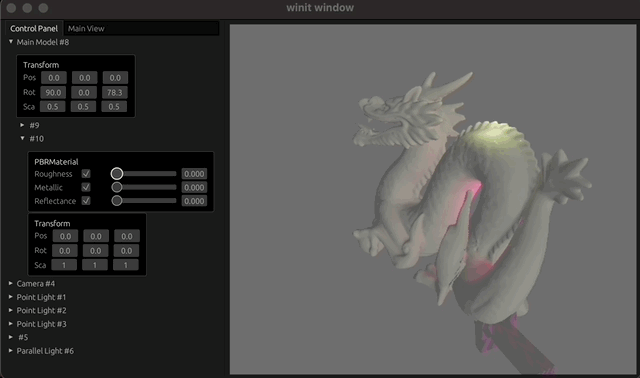

# Wgpu PBR

A realtime PBR renderer project for personal learning. Now it's in progress.

- Column major
- Right hand
- Y-up

Powered by

- [wgpu](https://wgpu.rs/): A cross-platform, safe, pure-rust graphics API.
- [winit](https://github.com/rust-windowing/winit): Cross-platform window creation and management in Rust.
- [cgmath](https://github.com/rustgd/cgmath): Mathmatic library.
- [bevy_ecs](https://docs.rs/bevy_ecs/latest/bevy_ecs/): Entity Component System architecture in Rust by bevy engine.
- [egui](https://github.com/emilk/egui): An easy-to-use GUI in pure Rust.

## Roadmap

- [x] Transform & Camera & Phong pipeline
- [x] Directional light shadow mapping
- [x] Normal mapping
- [x] Deferred rendering pipeline
- [x] Microfact directional lighting & point lighting
- [x] Color management
- [x] Microfact image based lighting
  - [x] Environment map prefiltering (GGX distribution)
  - [x] Diffuse irradiance spherical harmonics pre-calculation
  - [x] HDRI to cubemap converting
- [x] Transparent pipeline
  - [x] Transparent pass (separate specular and diffuse)
  - [x] Screenspace refraction effect
- [x] Multi-camera
- [ ] Simple gizmo system
- [ ] Cascade shadow mapping (CSM)
- [ ] WESL & Shader cache
- [ ] Forward+ pipeline
  - [ ] Material pattern
  - [ ] Light filtering
- [ ] Clear coat model
- [ ] Cascade shadow mapping

## Screenshot

- row 0: Solid | reflectance: 0.0 -> 1.0
- row 1: Solid | metallic: 0.0 -> 1.0
- row 2: Transparent | metaliic: 0.0 -> 1.0
- row 3: Transparent | reflectance: 0.0 -> 1.0

## License

[LICENSE.md](./LICENSE.md)
